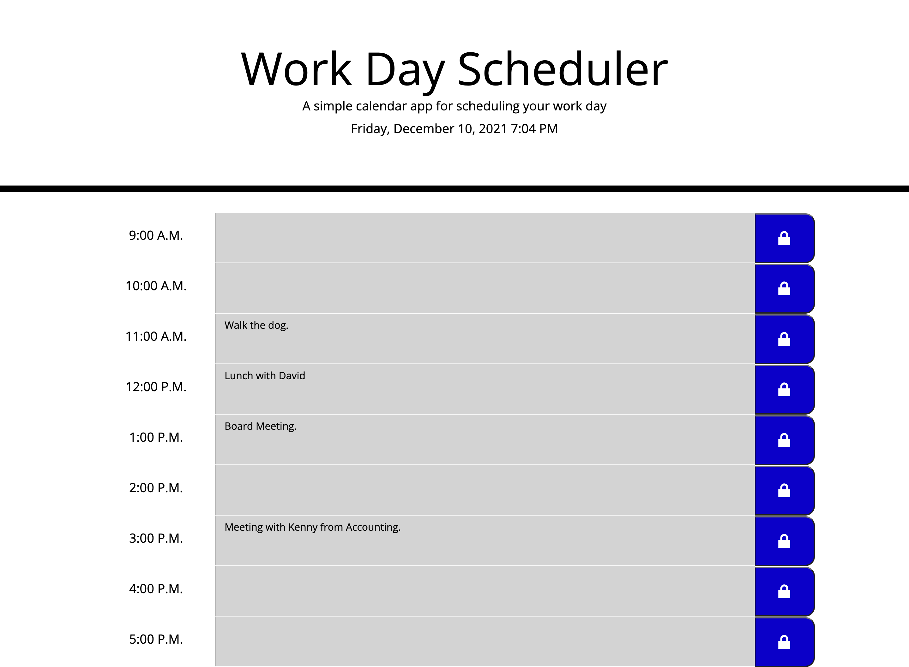

# Name of Application
Daily Work Scheduler

# Contirbutors
Presetup by UofO bootcamp - modified and simplified by Joseph Cooper

# Brief Description of Application
Daily Schedule Organzier

# Technology Used
HTML
CSS
JS

# Description
Daily Schedule Organzier. Allows user to plan their work dat and get up to date progress with color coding based on task complete in time. Allows user to plan the day then reload the appication with local storage to view saved events through out the day.

# Setup Requirements

click on the link   https://josephjamescoop.github.io/daily-work-scheduler/

alternatively you can follow these steps/

go to https://github.com/JosephJamesCoop/daily-work-scheduler and clone the repository
open file titled password-generator-challenge
open index.html in default browser

# Known Bugs
No known bugs.

# Preview of Appliaction Loaded Properly

